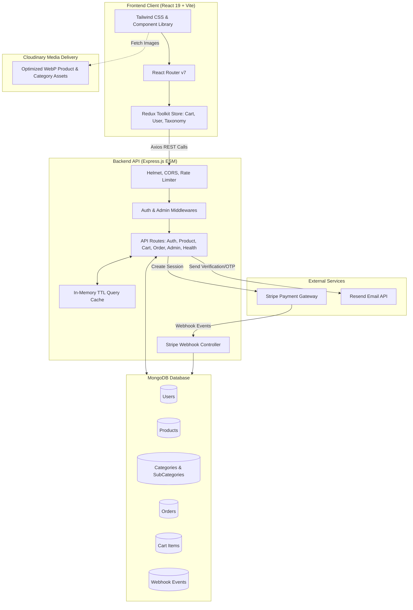
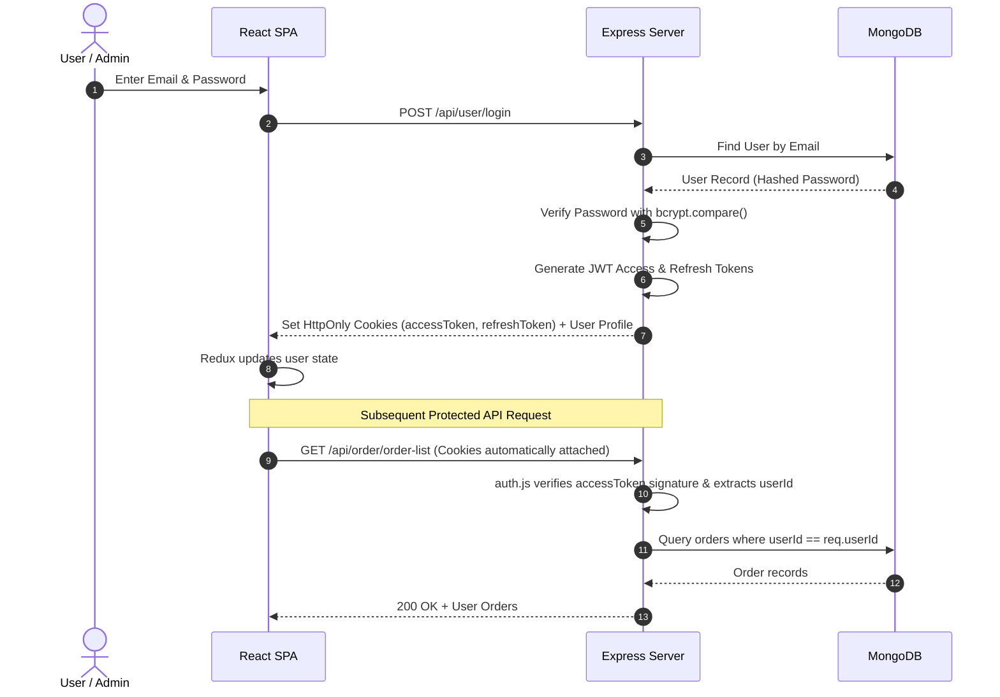
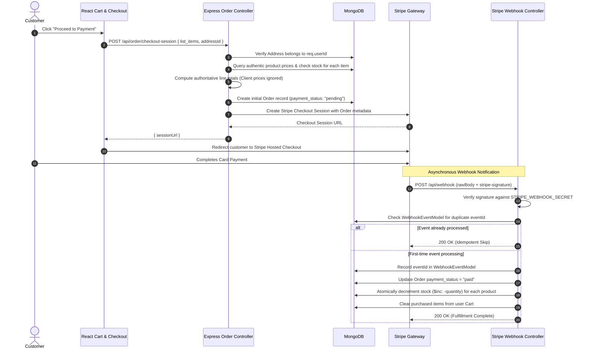
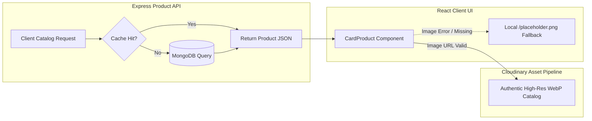

# GrabItGo — Production Quick-Commerce Platform

GrabItGo is a full-stack, enterprise-grade quick-commerce web application engineered for high-throughput grocery delivery, resilient inventory management, and lightning-fast customer browsing experiences.

Built with **Node.js, Express, MongoDB, React 19, Vite, Tailwind CSS, Redux Toolkit, Stripe, and Cloudinary**, GrabItGo features server-authoritative commerce security, idempotent payment webhooks, real-time inventory validation, responsive mobile-first UI/UX, and an authentic Cloudinary-optimized media delivery pipeline.

---

## Table of Contents
1. [Key Features](#key-features)
2. [Technology Stack](#technology-stack)
3. [System Architecture](#system-architecture)
   - [High-Level System Architecture](#high-level-system-architecture)
   - [Authentication & Session Flow](#authentication--session-flow)
   - [Checkout, Stripe & Webhook Fulfillment Flow](#checkout-stripe--webhook-fulfillment-flow)
   - [Product & Image Delivery Flow](#product--image-delivery-flow)
4. [Commerce & Inventory Model](#commerce--inventory-model)
5. [Security & Hardening](#security--hardening)
6. [Performance Optimizations](#performance-optimizations)
7. [Admin Capabilities](#admin-capabilities)
8. [Health Check & Monitoring](#health-check--monitoring)
9. [Automated Test Suite & Quality Assurance](#automated-test-suite--quality-assurance)
10. [Local Development Setup](#local-development-setup)
11. [Environment Variables](#environment-variables)
12. [Safe Demo & Evaluation Data](#safe-demo--evaluation-data)
13. [Project Directory Structure](#project-directory-structure)
14. [Deployment Notes](#deployment-notes)
15. [Known Limitations & Protected Taxonomy](#known-limitations--protected-taxonomy)

---

## Key Features

### Customer Experience & Browsing
- **Lightning-Fast Catalog Navigation**: Multi-level category and subcategory browsing with dynamic URL routing and breadcrumbs.
- **Server-Side Product Sorting & Filtering**:
  - Sort by *Price: Low to High* (`price_asc`), *Price: High to Low* (`price_desc`), and *Discount: Highest First* (`discount_desc`).
  - Filter by *In Stock Only* (`inStock=true`).
  - Full synchronization of active sort/filter states with URL query parameters for seamless bookmarking and sharing.
- **Debounced Instant Search**: Real-time product search with query debouncing, race-condition safety, and cached responses.
- **Mobile-First Responsive Layout**: Drawer navigation, bottom sheets, touch-optimized product cards, and uncluttered mobile catalog bars.
- **Resilient UI States**: Skeleton loading states, graceful empty states, React Error Boundaries, and user-friendly 404 recovery.

### Cart, Stock & Checkout
- **Real-Time Stock Clamping**: Live stock verification prevents adding quantities exceeding available warehouse inventory.
- **Server-Authoritative Pricing**: Total amounts, discounts, and line-item prices are strictly calculated server-side from database records — never trusting client payloads.
- **Stripe Checkout Integration**: Seamless, secure card checkout hosted by Stripe.
- **Idempotent Webhook Processing**: Atomic stock decrement, order transition to `paid`, and deduplicated webhook event recording via `WebhookEventModel`.

### Administrative Powerhouse
- **Admin Order Management**: Dedicated dashboard with search by Order ID / customer details, payment status filtering (`paid`, `cash_on_delivery`, `cancelled`), and atomic status updates.
- **Product & Taxonomy Management**: Full CRUD operations for Products, Categories, and Subcategories with Cloudinary asset management.

---

## Technology Stack

| Layer | Technologies |
| :--- | :--- |
| **Frontend** | React 19, React Router v7, Redux Toolkit, Tailwind CSS v4, Lucide & React Icons, Axios, Vite 7 |
| **Backend** | Node.js (ESM), Express.js, Mongoose 8 (MongoDB ODM), Stripe SDK, Resend (Transactional Email), Cloudinary SDK, Multer |
| **Security** | Helmet, CORS, Express Rate Limit, BcryptJS, JWT (Access + Refresh HttpOnly Cookies), MongoDB Lean Projections |
| **Testing** | Node.js Test Runner, Automated Core Commerce Regression Suite (35 tests), Image Import Pipeline Validator (26 tests) |

---

## System Architecture

### High-Level System Architecture



---

### Authentication & Session Flow



---

### Checkout, Stripe & Webhook Fulfillment Flow



---

### Product & Image Delivery Flow



---

## Commerce & Inventory Model

1. **Stock Clamping**: Users cannot add or increment items in their cart beyond current warehouse stock.
2. **Server-Side Price Authority**: During order checkout, prices and discounts are read directly from `ProductModel`. Any prices provided in client requests are discarded.
3. **Multi-Item Atomicity**: Orders with multiple items are evaluated as a single coherent transaction; if any product is out of stock, order creation is halted before charges occur.
4. **Idempotent Webhooks**: Double-decrementing inventory is mathematically prevented by tracking processed Stripe event IDs in `WebhookEventModel`.

---

## Security & Hardening

- **Helmet Security Headers**: Automatically applies Content Security Policy (CSP), frameguard, XSS filter, and HSTS.
- **Strict CORS with Credentials**: Restricted to authorized origins (`FRONTEND_URL`) with cookie support.
- **Express Rate Limiting**: Protects against brute-force attacks on authentication and order endpoints.
- **HttpOnly & SameSite Cookies**: JWT access and refresh tokens stored securely away from JavaScript DOM access (mitigating XSS token theft).
- **Ownership & Authorization Middleware**:
  - `auth.js`: Enforces valid session and attaches verified `userId`.
  - `Admin.js`: Strictly gates administrative endpoints to `role: 'ADMIN'`.
  - Data queries (cart, orders, addresses) strictly filter by `userId: req.userId` to eliminate Insecure Direct Object References (IDOR).
- **Safe Projections & Sanitization**: Projections prevent leaking password hashes, internal timestamps, or sensitive tokens.

---

## Performance Optimizations

- **Server-Side In-Memory Caching**: High-traffic product catalog queries (`getProductController`, `getProductByCategory`) use memory caching with automatic 60-second TTL invalidation on product writes.
- **Search Query Debouncing**: 300ms responsive client debounce ensures search requests are sequenced smoothly without triggering unnecessary database load.
- **Request Sequence Guarding**: Client components utilize `useRef` sequence counters to drop out-of-order asynchronous responses.
- **Optimized Asset Pipeline**: Catalog assets are served in compressed modern `WebP` format from Cloudinary CDN.
- **Vite Production Bundling & Code Splitting**: Dynamic route chunking ensures initial bundle size is minimized.

---

## Admin Capabilities

Administrators have access to full back-office tools:
1. **Catalog Management**: Create, edit, and delete products, categories, and subcategories.
2. **Order Management Dashboard** (`/dashboard/admin-orders`):
   - Real-time search across customer orders by Order ID.
   - Filter orders by payment status (`All`, `Paid`, `Cash on Delivery`, `Cancelled`).
   - Paginated table view with expandable line items, delivery address details, and price breakdowns.
   - Immediate administrative status transition controls.

---

## Health Check & Monitoring

GrabItGo includes an enterprise health-check endpoint for container orchestration and uptime monitoring:

```http
GET /api/health
```

### Healthy Response (HTTP 200)
```json
{
  "status": "ok",
  "database": "connected",
  "uptime": 1420.55,
  "environment": "production",
  "timestamp": "2026-09-26T20:30:00.000Z"
}
```

### Degraded Response (HTTP 503)
```json
{
  "status": "service_unavailable",
  "database": "disconnected",
  "uptime": 12.3,
  "environment": "production",
  "timestamp": "2026-09-26T20:30:00.000Z"
}
```

---

## Automated Test Suite & Quality Assurance

GrabItGo enforces automated regression testing across all critical business pathways.

### Test Breakdown
| Suite | Script | Tests | Status |
| :--- | :--- | :--- | :--- |
| **Core Commerce Suite** | `node server/scripts/test-core-api.js` | **35 / 35** | **PASS** |
| **Image Pipeline Suite** | `node server/scripts/image-import/test-import-pipeline.js` | **26 / 26** | **PASS** |
| **Client Code Quality** | `npm --prefix client run lint` | **0 errors / 0 warnings** | **PASS** |
| **Production Build** | `npm --prefix client run build` | **All chunks clean** | **PASS** |
| **Server Code Syntax** | `find server -name "*.js" -exec node --check {} +` | **0 syntax errors** | **PASS** |

### Running the Test Suites

```bash
# 1. Run the Core Commerce Regression Suite (35 tests)
node server/scripts/test-core-api.js

# 2. Run the Image Import Pipeline Suite (26 tests)
node server/scripts/image-import/test-import-pipeline.js

# 3. Verify Client Linting
npm --prefix client run lint

# 4. Verify Client Production Build
npm --prefix client run build

# 5. Verify Server Syntax
find server -name "*.js" -not -path "*/node_modules/*" -exec node --check {} +
```

---

## Local Development Setup

### Prerequisites
- **Node.js**: v18.0.0 or higher
- **MongoDB**: v6.0 or higher (running locally on port 27017 or MongoDB Atlas URI)
- **npm**: v9.0 or higher

### 1. Clone & Install Dependencies

```bash
# Clone the repository
git clone https://github.com/vinayaksharma4777/GrabItGo-Backup-.git
cd GrabItGo-Backup-

# Install root dependencies
npm install

# Install server dependencies
npm --prefix server install

# Install client dependencies
npm --prefix client install
```

### 2. Configure Environment Files

Create `.env` files from provided templates:

```bash
# Server Environment
cp server/.env.example server/.env

# Client Environment
cp client/.env.example client/.env
```

### 3. Seed Safe Demo Data (Optional)

```bash
node server/scripts/seed-demo-data.js
```

### 4. Start Development Servers

```bash
# Terminal 1 — Start Backend Server (Default: http://localhost:8050)
npm --prefix server run dev

# Terminal 2 — Start Frontend Client (Default: http://localhost:5173)
npm --prefix client run dev
```

---

## Environment Variables

### Server Configuration (`server/.env`)
| Variable | Description | Example / Default |
| :--- | :--- | :--- |
| `PORT` | Backend listening port | `8050` |
| `NODE_ENV` | Environment mode | `development` / `production` |
| `MONGODB_URI` | MongoDB Connection URI | `mongodb://127.0.0.1:27017/grabitgo` |
| `FRONTEND_URL` | Allowed CORS origin | `http://localhost:5173` |
| `SECRET_KEY_ACCESS_TOKEN` | JWT Access Token Secret | `your_access_token_secret` |
| `SECRET_KEY_REFRESH_TOKEN` | JWT Refresh Token Secret | `your_refresh_token_secret` |
| `CLOUDINARY_CLOUD_NAME` | Cloudinary Cloud Name | `your_cloud_name` |
| `CLOUDINARY_API_KEY` | Cloudinary API Key | `your_api_key` |
| `CLOUDINARY_API_SECRET_KEY`| Cloudinary API Secret | `your_api_secret` |
| `RESEND_API` | Resend Transactional Email API Key | `re_your_resend_api_key` |
| `STRIPE_SECRET_KEY` | Stripe Secret API Key | `sk_test_your_key` |
| `STRIPE_WEBHOOK_SECRET` | Stripe Webhook Signing Secret | `whsec_your_secret` |
| `STRIPE_CURRENCY` | Base checkout currency | `inr` |

### Client Configuration (`client/.env`)
| Variable | Description | Example / Default |
| :--- | :--- | :--- |
| `VITE_API_BASE_URL` | Base Backend API URL | `http://localhost:8050` |
| `VITE_STRIPE_PUBLIC_KEY` | Stripe Publishable Key | `pk_test_your_key` |

---

## Safe Demo & Evaluation Data

For local evaluations and portfolio reviews, a dedicated and isolated demo seeder is included:

```bash
# Create isolated demo user and admin accounts
node server/scripts/seed-demo-data.js

# Remove demo records at any time
node server/scripts/seed-demo-data.js --clean
```

### Synthetic Demo Credentials (Local / Demo Use Only)
| Role | Email | Password | Scope |
| :--- | :--- | :--- | :--- |
| **Administrator** | `demo.admin@grabitgo.demo` | `DemoAdmin@123` | Full catalog, product, category, and order management |
| **Customer** | `demo.customer@grabitgo.demo` | `DemoUser@123` | Standard shopping, cart, checkout, and address management |

*Note: The demo seeder operates strictly with isolation markers (`@grabitgo.demo`), never mutates authentic catalog products/images, and never creates fake payment records.*

---

## Project Directory Structure

```
GrabItGo/
├── client/                     # Frontend Single Page Application
│   ├── public/                 # Static assets, favicons & fallback images
│   ├── src/
│   │   ├── common/             # API endpoints mapping (SummaryApi.js)
│   │   ├── components/         # Reusable UI components (ProductSortFilter, CardProduct, etc.)
│   │   ├── hooks/              # Custom React hooks (useMobile, useDebounce)
│   │   ├── layouts/            # Page layouts & admin permission wrappers
│   │   ├── pages/              # Route pages (Home, ProductListPage, SearchPage, AdminOrders, etc.)
│   │   ├── provider/           # Global context providers
│   │   ├── store/              # Redux store slices (userSlice, productSlice, cartSlice)
│   │   └── utils/              # Client utilities & Axios instance
│   ├── package.json
│   └── vite.config.js
│
├── server/                     # Backend REST API Server
│   ├── config/                 # DB connection, Cloudinary, Resend, Environment config
│   ├── controllers/            # Controller business logic (product, order, cart, health, webhook)
│   ├── middleware/             # Auth, Admin guard, rate limiter, error handlers, multer
│   ├── models/                 # Mongoose schemas (user, product, category, order, webhookEvent)
│   ├── route/                  # Express route definitions
│   ├── scripts/                # Test suites & safe demo seeder
│   │   ├── image-import/       # Authentic Cloudinary image migration & validation engine
│   │   ├── seed-demo-data.js   # Isolated, idempotent demo data utility
│   │   └── test-core-api.js    # 35-test core commerce automated regression suite
│   ├── index.js                # Server entry point
│   └── package.json
│
├── image-manifest/             # Validated subcategory migration manifests
├── .env.example                # Root environment variables template
├── README.md                   # Project documentation & architecture guide
└── TODO.md                     # Roadmap & phase tracking
```

---

## Deployment Notes

For detailed provider-neutral instructions and preflight checklists, see [docs/DEPLOYMENT.md](docs/DEPLOYMENT.md).

1. **Database Readiness**: Ensure MongoDB index creation completes before routing production traffic.
2. **Stripe Webhook Endpoint**: In your Stripe Dashboard, register `https://<your-api-domain>/api/stripe-webhook` with event `checkout.session.completed` and set `STRIPE_WEBHOOK_SECRET` in environment variables.
3. **CORS Configuration**: In production, set `FRONTEND_URL` to your exact frontend domain (e.g. `https://grabitgo.yourdomain.com`).
4. **Health Check Probing**: Configure your cloud provider (e.g. Render, Railway, AWS ECS, Kubernetes) to monitor `GET /api/health`.
5. **SPA Fallback**: Ensure frontend web server rewrites all non-static asset routes to `/index.html`.

---

## Known Limitations & Protected Taxonomy

- **Deliberately Preserved Legacy Subcategories**: During catalog image migration, three legacy taxonomy nodes (`Noodles`, `Oral Health & Eye Care`, `Protections`) were intentionally preserved in their historical data state to guarantee backward compatibility with legacy references.
- **Client Cache TTL**: Product catalog queries are cached in-memory for 60 seconds on the server to optimize read throughput. Catalog changes appear instantaneously in admin views and propagate to cached endpoints within 60 seconds.

---

## License

This project is licensed under the [MIT License](LICENSE).
