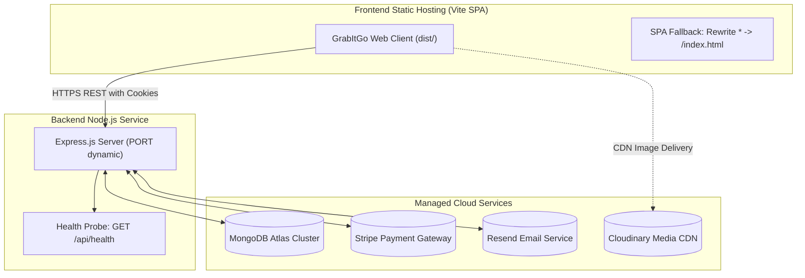

# GrabItGo — Production Deployment Guide & Preflight Checklist

This guide outlines the provider-neutral infrastructure requirements, environment variables, hosting configurations, and post-deployment validation steps required to deploy the GrabItGo quick-commerce platform to production.

---

## 1. Infrastructure Overview



---

## 2. Environment Variables Checklist

### Backend Environment (`server/.env`)
| Variable | Required | Description | Example / Recommended |
| :--- | :---: | :--- | :--- |
| `NODE_ENV` | **Yes** | Execution mode | `production` |
| `PORT` | **Yes** | Server listening port | Set automatically by PaaS (e.g. `8050`) |
| `MONGODB_URI` | **Yes** | MongoDB connection string with credentials | `mongodb+srv://<user>:<password>@<cluster>.mongodb.net/grabitgo?retryWrites=true&w=majority` |
| `FRONTEND_URL` | **Yes** | Exact frontend origin for CORS | `https://grabitgo.yourdomain.com` |
| `SECRET_KEY_ACCESS_TOKEN` | **Yes** | High-entropy secret for JWT access tokens | 64+ char random hexadecimal string |
| `SECRET_KEY_REFRESH_TOKEN` | **Yes** | High-entropy secret for JWT refresh tokens | 64+ char random hexadecimal string |
| `CLOUDINARY_CLOUD_NAME` | **Yes** | Cloudinary cloud identifier | Cloudinary account cloud name |
| `CLOUDINARY_API_KEY` | **Yes** | Cloudinary API access key | Cloudinary account API key |
| `CLOUDINARY_API_SECRET_KEY` | **Yes** | Cloudinary API secret | Cloudinary account API secret |
| `RESEND_API` | **Yes** | Resend Transactional Email API Key | `re_123456789abcdef...` |
| `STRIPE_SECRET_KEY` | **Yes** | Stripe secret API key (Live / Test) | `sk_live_...` or `sk_test_...` |
| `STRIPE_WEBHOOK_SECRET` | **Yes** | Stripe Webhook Signing Secret | `whsec_...` |
| `STRIPE_CURRENCY` | Optional | Default transaction currency | `inr` (default) |

### Frontend Environment (`client/.env`)
| Variable | Required | Description | Example / Recommended |
| :--- | :---: | :--- | :--- |
| `VITE_API_BASE_URL` | **Yes** | Base URL of deployed backend API | `https://api.grabitgo.yourdomain.com` |
| `VITE_STRIPE_PUBLIC_KEY` | Optional | Stripe publishable key for client elements | `pk_live_...` or `pk_test_...` (can also be supplied dynamically by server) |

---

## 3. Backend Deployment Contract

### Commands
- **Install Dependencies**: `npm install --omit=dev`
- **Start Command**: `npm start` (executes `node index.js`)

### Runtime Expectations
1. **Dynamic Port Binding**: The application reads `process.env.PORT` dynamically and binds to `0.0.0.0:${PORT}`.
2. **Health Check Probing**: Cloud platforms should configure liveness and readiness probes pointing to:
   ```http
   GET /api/health
   ```
   - Returns **HTTP 200** with `{ "status": "ok", "database": "connected" }` when healthy.
   - Returns **HTTP 503** with `{ "status": "degraded", "database": "disconnected" }` if MongoDB is disconnected.
3. **Graceful Error Handling**: In `NODE_ENV=production`, stack traces and internal database errors are suppressed; generic, safe JSON responses are returned.
4. **CORS & Cookie Topology**:
   - `credentials: true` is enabled on the server.
   - Cookies are sent with `SameSite=None; Secure` in production for cross-origin frontend/backend topologies.
   - Ensure `FRONTEND_URL` exactly matches the protocol and domain of the frontend application (no trailing slash).

---

## 4. Frontend Deployment & SPA Routing Contract

### Commands
- **Install Dependencies**: `npm install`
- **Build Command**: `npm run build` (executes `vite build`)
- **Output Directory**: `dist/`

### SPA Fallback Requirement
GrabItGo is a Single Page Application (SPA) using HTML5 client-side routing (`react-router-dom`). Direct requests to sub-routes (e.g. `/search`, `/dashboard/admin-orders`, `/category/dairy`, `/login`) must be rewritten to serve `/index.html` with HTTP 200.

#### Provider-Neutral Server Configurations:

- **Nginx**:
  ```nginx
  location / {
    root /var/www/grabitgo/dist;
    index index.html;
    try_files $uri $uri/ /index.html;
  }
  ```

- **Apache (`.htaccess`)**:
  ```apache
  <IfModule mod_rewrite.c>
    RewriteEngine On
    RewriteBase /
    RewriteRule ^index\.html$ - [L]
    RewriteCond %{REQUEST_FILENAME} !-f
    RewriteCond %{REQUEST_FILENAME} !-d
    RewriteRule . /index.html [L]
  </IfModule>
  ```

- **Cloudflare Pages / Netlify (`_redirects`)**:
  ```
  /*    /index.html   200
  ```

- **Vercel (`vercel.json`)**:
  ```json
  {
    "rewrites": [{ "source": "/(.*)", "destination": "/index.html" }]
  }
  ```

- **AWS S3 + CloudFront**:
  - Configure Custom Error Response: HTTP Error Code `404` -> Response Page Path `/index.html` with HTTP Response Code `200`.

---

## 5. Stripe Webhook Production Setup

1. In the **Stripe Dashboard** (Live or Test mode), navigate to **Developers > Webhooks**.
2. Click **Add endpoint**.
3. **Endpoint URL**: `https://<your-api-domain>/api/stripe-webhook`
4. **Events to listen to**:
   - `checkout.session.completed`
5. Copy the **Signing secret** (`whsec_...`) and set it as `STRIPE_WEBHOOK_SECRET` in your backend environment variables.
6. The GrabItGo server automatically parses the raw webhook body, verifies the Stripe signature, prevents replay attacks, and ensures idempotent stock decrement.

---

## 6. Pre-Deployment Quality Checklist

Before promoting any release to production, confirm that all quality gates pass:

```bash
# 1. Core Commerce Automated Regression Suite (35 tests)
node server/scripts/test-core-api.js

# 2. Image Migration Pipeline Test Suite (26 tests)
node server/scripts/image-import/test-import-pipeline.js

# 3. Client ESLint Validation
npm --prefix client run lint

# 4. Client Production Build Validation
npm --prefix client run build

# 5. Server Syntax Check
find server -name "*.js" -not -path "*/node_modules/*" -exec node --check {} +
```

---

## 7. Post-Deployment Smoke Tests

Execute this verification sequence on the live production deployment:

- [ ] **Health Check**: Call `GET https://<api-domain>/api/health` and verify HTTP 200 response with `"database": "connected"`.
- [ ] **SPA Routing**: Navigate directly to `https://<frontend-domain>/search` in a private browsing window and refresh the page (verify HTTP 200, no 404 from host).
- [ ] **Catalog Browsing**: Browse categories and subcategories; verify WebP images load properly from Cloudinary CDN.
- [ ] **Product Sorting & Filtering**: Test *Price: Low to High*, *Discount: Highest First*, and *In Stock Only* filters.
- [ ] **Authentication**: Register a new user, verify email, and log in. Confirm cookies are set with `SameSite=None; Secure`.
- [ ] **Cart & Stock Validation**: Add items to cart; verify stock limits are enforced.
- [ ] **Checkout & Stripe Payment**: Place a test order via Stripe Checkout. Verify webhook completion transitions order status to `paid` and decrements stock.
- [ ] **Admin Dashboard**: Log in with an `ADMIN` account, access `/dashboard/admin-orders`, search orders, and test status transitions.

---

## 8. Rollback & Disaster Recovery Considerations

1. **Static Frontend Rollback**: Instant rollback to the previous immutable release bundle on CDN hosting.
2. **Backend Rollback**: Revert deployment container image to the prior tagged release version.
3. **Database Backups**: Maintain automated daily snapshot backups with Point-In-Time Recovery (PITR) enabled in MongoDB Atlas.
4. **Stripe Idempotency**: If the backend is restarted during webhook delivery, Stripe will automatically retry unacknowledged webhook events up to 72 hours with exponential backoff.
